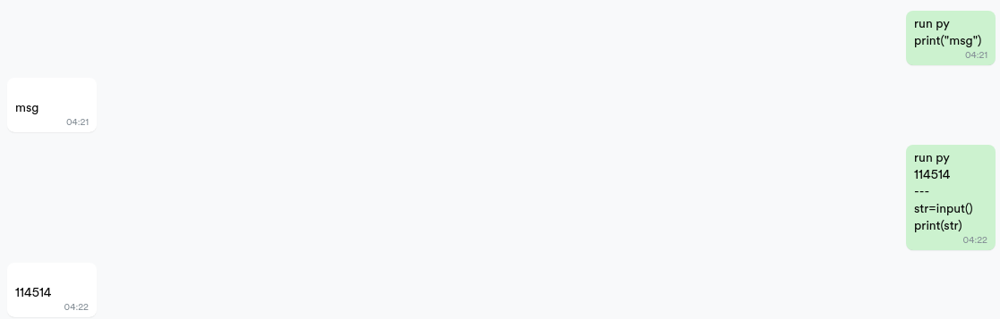

# Codeforces_bot

## 部署

首先需要安装`go-cqhttp` [Link](https://github.com/Mrs4s/go-cqhttp/releases)

关于`go-cqhttp`和本bot的通信配置，请查阅[CQHTTP 协议使用指南](https://v2.nonebot.dev/guide/cqhttp-guide.html)

之后运行`pip install -r requirements.txt`安装环境变量

对于钉钉模块，使用前请配置好`src/dingtalk_services/__init__.py`文件中, `DingTalk_Client`的`__get_token`中`app_key`与`app_secret`两个个参数

最后运行`go-cqhttp`和`bot.py`文件

## 功能

### 查询codeforces个人信息

### 查询codeforces比赛信息

### codeforces赛前通知

### 查询天气

### 查询钉钉群中缺勤人员和请假人员的名单

### 在线运行代码
```
run (py|java|cpp|js|ts|c#|c|go|asm|rust|lua) 
可选的标准输入
---
代码
```



### 查询机器人运行状态

戳一戳机器人或 发送 `状态`

## Todo

- [ ] 将比赛信息的获取方式改为调用codeforces的api
- [ ] 支持对atcoder和牛客网的比赛查询和通知
- [ ] 列出进30天中钉钉缺勤次数的统计